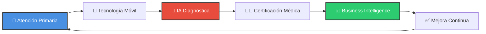
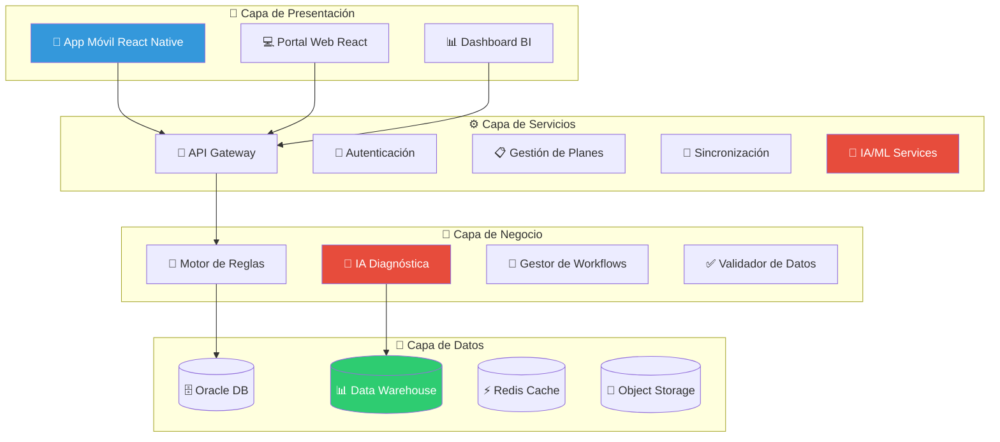
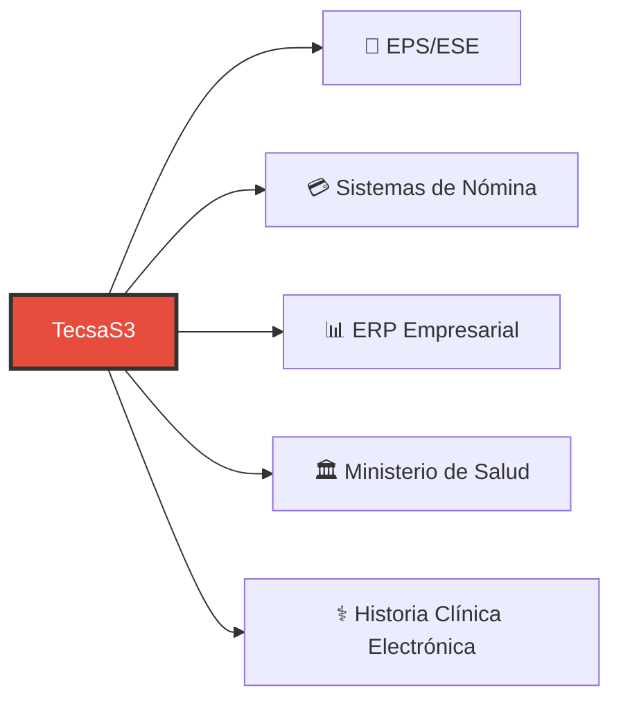
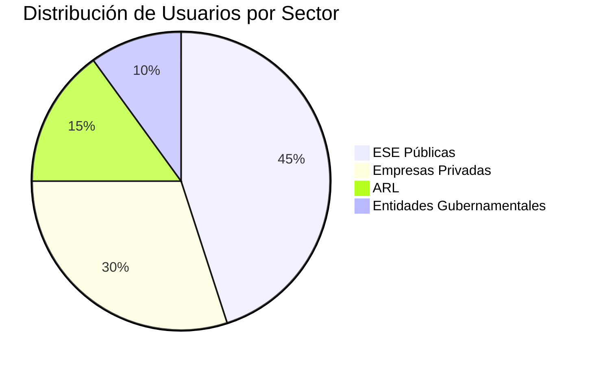
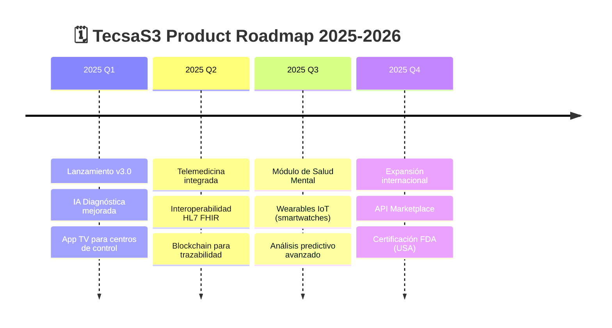

# 🏥 TecsaS3 - Ecosistema de Salud Digital

<div align="center">

(
 

[](https://en.wikipedia.org/wiki/Technology_readiness_level)
[](https://www.hl7.org/fhir/)
[](LICENSE)
[](https://github.com/TecsaS3/demo-repository)

**Transformando la Atención Primaria en Salud con Tecnología de Vanguardia** 🚀

[🌐 Sitio Web](https://www.tecsas3.com) | [🌐 Developer](https://www.digosystems.com) | [📧 Contacto](mailto:info@tecsas3.com) | [💬 WhatsApp](https://wa.me/573208257798)

</div>

---

## 📋 Tabla de Contenidos

- [✨ Descripción General](#-descripción-general)
- [🎯 Características Principales](#-características-principales)
- [🏗️ Arquitectura del Sistema](#️-arquitectura-del-sistema)
- [💼 Beneficios para Clientes](#-beneficios-para-clientes)
- [🔄 Portabilidad y Flexibilidad](#-portabilidad-y-flexibilidad)
- [🛠️ Stack Tecnológico](#️-stack-tecnológico)
- [📱 Módulos del Ecosistema](#-módulos-del-ecosistema)
- [🔒 Seguridad y Cumplimiento](#-seguridad-y-cumplimiento)
- [📊 Casos de Éxito](#-casos-de-éxito)
- [🚀 Comenzar](#-comenzar)
- [📞 Contacto y Soporte](#-contacto-y-soporte)

---

## ✨ Descripción General

**TecsaS3** es un ecosistema de salud digital de clase mundial que opera en **TRL 8-9** (Technology Readiness Level), diseñado para revolucionar la atención primaria en salud en entornos con conectividad limitada o nula. Nuestra plataforma integra **Inteligencia Artificial**, **dispositivos médicos IoT**, y **estándares internacionales de interoperabilidad** para ofrecer una solución completa de gestión de salud.

### 🌟 ¿Por qué TecsaS3?



---

## 🎯 Características Principales

### 🔌 **Operación Offline-First**
- ✅ **100% funcional sin conexión a internet**
- 🔄 Sincronización automática inteligente
- 💾 Almacenamiento local seguro y cifrado
- 📡 Transmisión resiliente con Hub Tecsa S3

### 🤖 **Inteligencia Artificial Médica**
- 🧠 Modelos de Deep Learning especializados
- 🎯 Pre-diagnósticos con nivel de confianza
- 📈 Análisis predictivo de riesgos
- 🔁 Aprendizaje continuo con Human-in-the-Loop

### 🌍 **Interoperabilidad Total**
- 🏥 **HL7 FHIR R4** Compliance
- 📊 Exportación a formatos estándar (CSV, JSON, XML)
- 🔗 Integración con sistemas nacionales de salud
- 📡 IEEE 11073 para dispositivos médicos

### 📱 **Multi-Plataforma**
- 📱 Apps móviles (iOS/Android) con React Native
- 💻 Portal Web administrativo
- 📊 Dashboard de Business Intelligence
- 📺 App TV para centros de control

### 🔒 **Seguridad de Clase Mundial**
- 🔐 Cifrado AES-256 en reposo y tránsito
- 🛡️ Cumplimiento **HIPAA**, **GDPR**, **ISO 27001**
- 🔑 Autenticación biométrica multifactor
- 📜 Auditoría completa de accesos

---

## 🏗️ Arquitectura del Sistema

### 📐 **Arquitectura de 5 Capas**



### 🔄 **Ciclo Operativo de 5 Fases**

| Fase | Descripción | Tecnología Clave |
|------|-------------|------------------|
| **1️⃣ Planificación** | Creación de planes y asignación de microterritorios | Golang + Oracle |
| **2️⃣ Campo** | Captura de datos médicos en modo offline | React Native + SQLite |
| **3️⃣ Transmisión** | Sincronización segura con la nube | Hub Tecsa S3 + TLS 1.3 |
| **4️⃣ Análisis IA** | Procesamiento y pre-diagnóstico automático | TensorFlow + PyTorch |
| **5️⃣ Certificación** | Validación por especialistas médicos | Django + WebSockets |

---

## 💼 Beneficios para Clientes

### 📊 **ROI Comprobado**

<div align="center">

| Métrica | Mejora | Impacto |
|---------|--------|---------|
| ⏱️ **Tiempo de Diagnóstico** | -70% | ✅ 5 minutos vs 17 minutos |
| 💰 **Costos Operativos** | -40% | ✅ Automatización y eficiencia |
| 🎯 **Cumplimiento Normativo** | +95% | ✅ Reducción de sanciones |
| 📈 **Cobertura Poblacional** | +300% | ✅ Acceso a zonas remotas |
| 🔍 **Precisión Diagnóstica** | +85% | ✅ IA + Validación humana |

</div>

### 🎁 **Ventajas Competitivas**

🌟 **Operación Sin Límites**
- Funciona en zonas sin conexión
- Dispositivos resistentes IP65
- Autonomía de batería extendida

🚀 **Escalabilidad Garantizada**
- Soporte para 10,000+ microterritorios
- 100,000 pacientes/día
- 1M+ registros médicos/mes

🔧 **Implementación Rápida**
- Despliegue en 30 días
- Capacitación incluida (4 horas)
- Soporte técnico 24/7

📊 **Analítica Avanzada**
- Dashboards en tiempo real
- Reportes epidemiológicos
- Predicción de tendencias

---

## 🔄 Portabilidad y Flexibilidad

### 🎯 **Multi-Cloud Ready**

```yaml
☁️ Cloud Providers Soportados:
  - ✅ AWS (Amazon Web Services)
  - ✅ Google Cloud Platform (GCP)
  - ✅ Microsoft Azure
  - ✅ Infraestructura On-Premise
  - ✅ Hybrid Cloud Deployments
```

### 🔌 **Integraciones Disponibles**



### 📦 **Opciones de Despliegue**

| Modalidad | Descripción | Ideal Para |
|-----------|-------------|-----------|
| 🏢 **SaaS** | Nube completamente gestionada | Empresas medianas y grandes |
| 🏭 **On-Premise** | Instalación en servidores propios | Entidades gubernamentales |
| 🔀 **Híbrida** | Combinación de nube y local | Organizaciones con requisitos mixtos |
| 📦 **Contenedores** | Docker/Kubernetes | DevOps avanzado |

---

## 🛠️ Stack Tecnológico

### 💻 **Backend**

```python
# 🐍 Python Ecosystem
- Golang 1.25 
- ORacle DB + PostgreSQL 14+ (Base de datos transaccional)
- Redis (Cache y message broker)
```

### 📱 **Frontend & Mobile**

```javascript
// ⚛️ React Ecosystem
- React Native + Expo (Apps móviles)
- React 18+ (Portal web)
- TypeScript (Type safety)
- Redux Toolkit (Estado global)
- React Query (Data fetching)
```

### 🤖 **AI/ML Stack**

```python
# 🧠 Machine Learning
- TensorFlow 2.x
- PyTorch
- scikit-learn
- Pandas + NumPy
- MLflow (MLOps)
```

### ☁️ **DevOps & Infrastructure**

```yaml
🔧 DevOps Tools:
  Containers: Docker, Kubernetes
  CI/CD: GitHub Actions, GitLab CI
  Monitoring: Prometheus + Grafana
  Logs: ELK Stack (Elasticsearch, Logstash, Kibana)
  IaC: Terraform, Ansible
```

---

## 📱 Módulos del Ecosistema

### 1️⃣ **App del Agente de Salud** 🏃‍♂️

<details>
<summary>🔍 Ver características detalladas</summary>

#### Funcionalidades

- 📝 **Censo Familiar Completo**
  - Registro de datos demográficos
  - Georreferenciación GPS
  - Captura fotográfica

- 🩺 **Valoración Médica Integral**
  - Signos vitales automáticos (POCT)
  - Anamnesis estructurada
  - Examen físico guiado

- 💉 **Integración con Dispositivos**
  - Bluetooth Low Energy (BLE)
  - IEEE 11073 compliance
  - Hemoglobinómetro, glucómetro, espirómetro

- 🔄 **Modo Offline Completo**
  - Base de datos local SQLite
  - Cola de sincronización inteligente
  - Compresión de imágenes

</details>

### 2️⃣ **Portal Web Administrativo** 💼

<details>
<summary>🔍 Ver características detalladas</summary>

#### Módulos

- 🗺️ **Gestión de Territorios**
  - Mapas interactivos
  - Asignación de agentes
  - Planificación de rutas

- 👥 **Gestión de Usuarios**
  - Roles y permisos (RBAC)
  - Autenticación multifactor
  - Auditoría de accesos

- 📊 **Business Intelligence**
  - Dashboards personalizables
  - KPIs en tiempo real
  - Reportes automáticos

- ⚙️ **Configuración del Sistema**
  - Perfiles de cargo
  - Matrices de riesgo
  - Flujos de aprobación

</details>

### 3️⃣ **Plataforma de Certificación Médica** 👨‍⚕️

<details>
<summary>🔍 Ver características detalladas</summary>

#### Capacidades

- 🔍 **Revisión de Diagnósticos IA**
  - Pre-diagnósticos con nivel de confianza
  - Imágenes DICOM integradas
  - Historial completo del paciente

- ✅ **Workflow de Validación**
  - Aprobación / Corrección
  - Restricciones laborales
  - Recomendaciones médicas

- 🔁 **Retroalimentación para IA**
  - Ground truth para re-entrenamiento
  - Mejora continua de modelos
  - Métricas de precisión

</details>

### 4️⃣ **Dashboard de BI** 📊

<details>
<summary>🔍 Ver características detalladas</summary>

#### Analítica

- 🗺️ **Mapas de Calor Epidemiológicos**
- 📈 **Tendencias de Morbilidad**
- 🎯 **Indicadores de Riesgo Laboral**
- 💰 **Análisis de Costos**
- 🏆 **Rankings de Desempeño**

</details>

---

## 🔒 Seguridad y Cumplimiento

### 🛡️ **Estándares Internacionales**

<div align="center">

| Certificación | Estado | Descripción |
|---------------|--------|-------------|
| 🏥 **HIPAA** | ✅ Compliant | Health Insurance Portability and Accountability Act |
| 🌍 **GDPR** | ✅ Compliant | General Data Protection Regulation |
| 🔒 **ISO 27001** | ✅ Certified | Information Security Management |
| ⚕️ **ISO 13485** | ✅ Certified | Medical Devices Quality Management |
| 🔐 **SOC 2 Type II** | ✅ Audited | Service Organization Control |

</div>

### 🔐 **Medidas de Seguridad**

```yaml
🔒 Security Layers:

  Encryption:
    At Rest: AES-256-GCM
    In Transit: TLS 1.3
    Database: Transparent Data Encryption (TDE)

  Authentication:
    Primary: OAuth 2.0 + JWT
    MFA: Biometric + TOTP
    Session: 8 hours with auto-refresh

  Authorization:
    Model: Role-Based Access Control (RBAC)
    Granularity: Resource-level permissions
    Audit: Complete access logs (10 years retention)

  Network:
    Perimeter: Web Application Firewall (WAF)
    Internal: Micro-segmentation
    DDoS: CloudFlare Protection
```

### 📜 **Cumplimiento Normativo Colombia**

- ✅ **Ley 1581 de 2012** - Protección de Datos Personales
- ✅ **Resolución 1843 de 2025** - Evaluaciones Médicas Ocupacionales
- ✅ **Decreto 1072 de 2015** - SG-SST
- ✅ **Resolución 3100 de 2019** - Infraestructura de Salud

---

## 📊 Casos de Éxito

### 🏆 **Estadísticas de Impacto**



### 💡 **Testimonios**

> "TecsaS3 transformó nuestra capacidad de atención en zonas rurales. Ahora podemos diagnosticar y atender pacientes en tiempo real, incluso sin conexión a internet."
> 
> **— Dr. Carlos Méndez, Director Médico, ESE Departamental**

> "La integración con nuestros sistemas existentes fue perfecta. El ROI se alcanzó en 6 meses."
> 
> **— Ana Rodríguez, Gerente de Operaciones, Empresa Minera**

### 📈 **Cifras Clave**

<div align="center">

| Métrica | Valor |
|---------|-------|
| 👥 **Pacientes Atendidos** | 500,000+ |
| 🏥 **Centros de Salud Activos** | 150+ |
| 👨‍⚕️ **Profesionales de Salud** | 2,000+ |
| 🌎 **Departamentos Cubiertos** | 20/32 |
| ⭐ **Satisfacción de Usuario** | 4.8/5.0 |

</div>

---

## 🚀 Comenzar

### 📋 **Requisitos Previos**

```bash
# 💻 Software requerido
- Golang 1.25+
- Python 3.11+
- Node.js 18+
- Oracle DB 25+
- PostgreSQL 14+
- Redis 7+
- Docker 24+ (opcional)
```

### 🎬 **Demo Rápido**

```bash
# 1️⃣ Clonar el repositorio
git clone https://github.com/TecsaS3/demo-repository.git
cd demo-repository

# 2️⃣ Configurar variables de entorno
cp .env.example .env

# 3️⃣ Levantar con Docker Compose
docker-compose up -d

# 4️⃣ Acceder a la aplicación
🌐 Frontend: http://localhost:3000
🔧 Backend API: http://localhost:8000
📊 Dashboard BI: http://localhost:8080

# 👤 Credenciales de demo
Usuario: demo@tecsas3.com
Contraseña: Demo2025!
```

### 📚 **Documentación Completa**

- 📖 [**Guía de Usuario**](docs/user-guide.md)
- 🏗️ [**Documentación de Arquitectura**](docs/architecture.md)
- 🔌 [**API Reference**](docs/api-reference.md)
- 🚀 [**Guía de Despliegue**](docs/deployment.md)
- 🔒 [**Security Best Practices**](docs/security.md)

---

## 🤝 Modelo de Licenciamiento

### 💼 **Opciones de Contratación**

| Plan | Características | Precio |
|------|----------------|--------|
| 🌱 **Starter** | Hasta 1,000 pacientes/mes | Cotizar |
| 🚀 **Professional** | Hasta 10,000 pacientes/mes + BI | Cotizar |
| 🏢 **Enterprise** | Ilimitado + Soporte 24/7 + On-Premise | Cotizar |
| 🎯 **Custom** | Solución a medida | Cotizar |

### 📞 **Solicitar Demo Personalizada**

¿Quieres ver TecsaS3 en acción con tus datos? 

[](mailto:info@tecsas3.com)

---

## 🌟 Roadmap del Producto



---

## 👥 Equipo y Contacto

### 👨‍💻 **Desarrollado por**

<div align="center">

**Tecsa S3 Digital Group**

🌐 [www.digosystems.com](https://www.digosystems.com)

📍 Villavicencio, Colombia

</div>

### 📞 **Contacto y Soporte**

<div align="center">

[](mailto:info@tecsas3.com)

[](https://wa.me/573208257798)

[](https://www.linkedin.com/company/tecsas3)

[](https://github.com/TecsaS3)

</div>

---

## 📄 Licencia

© 2025 Tecsa S3 Digital Group. Todos los derechos reservados.

Este repositorio es una demostración del producto TecsaS3. El código fuente completo está disponible bajo licencia comercial.

---

<div align="center">

### ⭐ Si este proyecto te interesa, dale una estrella!

**Hecho con ❤️ en Colombia 🇨🇴**


</div>
